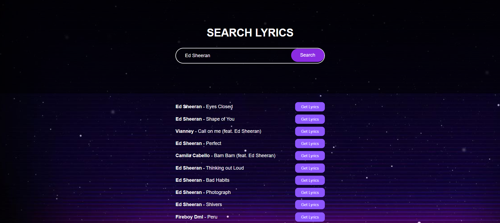

# LyricFinder

## Overview
LyricFinder is a cutting-edge lyrics discovery app that allows users to effortlessly find the lyrics to their favorite songs. Whether you're a passionate music lover or just looking to sing along with your favorite tunes, LyricFinder has got you covered. The app utilizes the powerful lyrics.ovh API to provide users with real-time access to a vast collection of song lyrics, making it a must-have tool for all music enthusiasts.

## Key Features
- **Effortless Lyrics Search:** Using LyricFinder, you can easily search for lyrics by entering the name of your favorite artist or song. The app quickly retrieves the most relevant and accurate lyrics from its extensive database.

- **Real-time Lyrics Display:** As soon as you submit your search query, LyricFinder dynamically displays the lyrics in a clean and visually appealing format. Say goodbye to fumbling through multiple websites to find your desired lyrics!

- **Interactive User Interface:** Experience an interactive interface that brings convenience to your fingertips. Clicking on the artist's name or the song title reveals a "Get Lyrics" button, enabling you to instantly access the complete lyrics.

- **Explore New Songs:** The "Get Lyrics" button not only fetches the lyrics but also presents essential song details, such as the artist's name and song title. This feature allows you to explore new artists and songs effortlessly.

## Technology Stack
- **Frontend Development:** HTML5 and CSS3 ensure a seamless and responsive user interface, adapting beautifully to various screen sizes.
- **Dynamic Functionality:** JavaScript is used to handle dynamic elements, API calls, and DOM manipulation, providing users with a smooth and interactive experience.
- **Lyrics Data:** LyricFinder harnesses the power of the lyrics.ovh API to retrieve and display the lyrics of your favorite songs in real-time.
